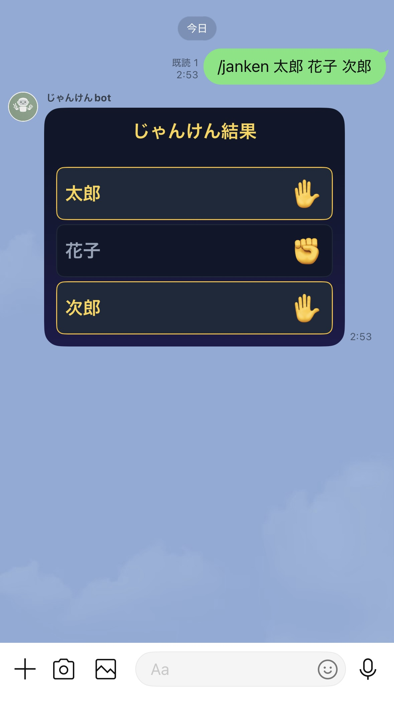
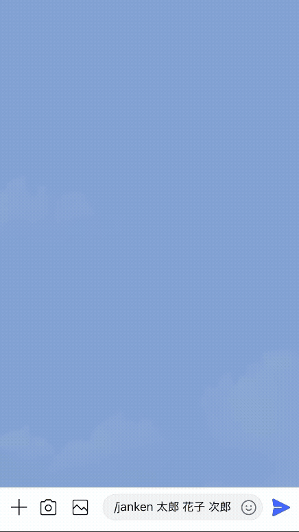
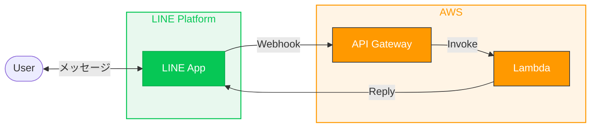

# janken-line-bot


LINE で `/janken 太郎 花子 次郎` のように送信すると、その人たちでじゃんけんを行うことができる LINE Bot。

<p align="center">
  
  &nbsp;&nbsp;&nbsp;&nbsp;
  
</p>

## アーキテクチャ



## セットアップ

### 1. LINE Developers でチャネル作成

1. [LINE Developers Console](https://developers.line.biz/console/) で **Messaging API** チャネルを作成
2. **チャネルアクセストークン** と **チャネルシークレット** を取得
3. **Webhook URL** に API Gateway のエンドポイントを設定（後述）
4. **Webhook の利用** を有効化、**応答メッセージ** を無効化

### 2. AWS Lambda を作成

```bash
aws lambda create-function \
  --function-name janken-line-bot \
  --runtime python3.12 \
  --role arn:aws:iam::<ACCOUNT_ID>:role/<EXECUTION_ROLE> \
  --handler main.lambda_handler \
  --timeout 30 \
  --memory-size 256 \
  --region ap-northeast-1 \
  --zip-file fileb://lambda_function.zip
```

環境変数として以下を設定：

| Key | Value |
|---|---|
| `LINE_CHANNEL_ACCESS_TOKEN` | LINE Developers で取得した値 |
| `LINE_CHANNEL_SECRET` | LINE Developers で取得した値 |

### 3. API Gateway を作成

- HTTP API を作成、Lambda 統合で `janken-line-bot` を指定
- 生成されたエンドポイントを LINE の Webhook URL に設定

### 4. デプロイ

ローカルから Lambda を更新する場合：

```bash
./scripts/deploy.sh
```

環境変数で関数名・リージョンの上書き可能：

```bash
FUNCTION_NAME=my-bot REGION=us-east-1 ./scripts/deploy.sh
```

## 使い方

LINE のグループまたは個人トークで以下を送信：

```
/janken 太郎 花子 次郎
```

- **2人以上 10人以下** で名前を指定
- 名前の重複はエラー
- 引数なしで送ると使い方が返る

## ディレクトリ構成

```
.
├── lambda/
│   ├── main.py            # Lambda エントリーポイント (Webhook処理 + じゃんけんロジック)
│   └── requirements.txt
├── scripts/
│   └── deploy.sh          # AWS Lambda へのデプロイスクリプト
├── .env.example           # 環境変数のテンプレート
└── README.md
```

## 技術スタック

- Python 3.12
- AWS Lambda + API Gateway
- LINE Messaging API (Webhook + Reply API + Flex Message)

## ライセンス

MIT
