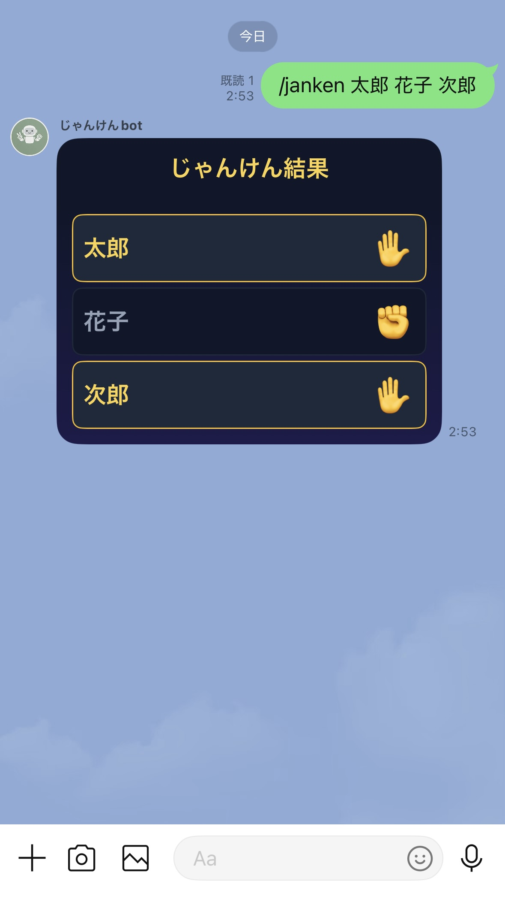
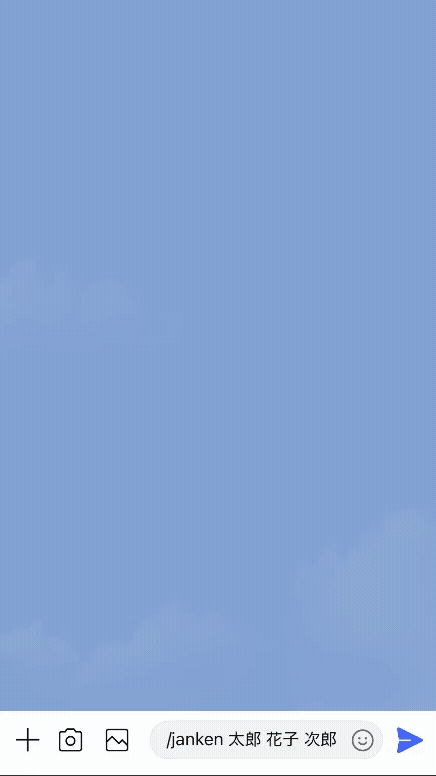
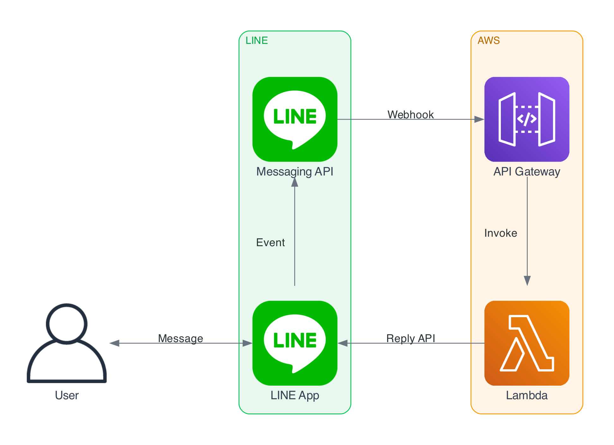

# Janken LINE Bot


A serverless LINE bot that plays **janken** (rock-paper-scissors) for you.
Send `/janken Taro Hanako Jiro` in any LINE chat, and the bot instantly draws hands
for every player and announces the winners in a rich, card-style message.

Perfect for settling everyday debates — who buys coffee, who goes first, who does the dishes.

<p align="center">
  
  &nbsp;&nbsp;&nbsp;&nbsp;
  
</p>

## Architecture

<p align="center">
  
</p>

<sub>Generated with [Diagrams](https://diagrams.mingrammer.com/) — see [docs/architecture.py](docs/architecture.py).</sub>

1. A user sends `/janken <names...>` in a LINE chat.
2. The LINE Platform delivers the event to an **API Gateway** endpoint via webhook.
3. **AWS Lambda** verifies the `X-Line-Signature` header, parses the command, plays the game, and replies through the LINE **Reply API**.

## Usage

Send the following in a group or 1-on-1 LINE chat:

```
/janken Taro Hanako Jiro
```

| Input | Behavior |
|---|---|
| 2–10 unique names | Plays janken and replies with a result card |
| `/janken` (no arguments) | Replies with usage instructions |
| Fewer than 2 names | Asks for at least 2 players |
| More than 10 names | Asks to reduce to 10 or fewer |
| Duplicate names | Asks for unique names |

## Getting Started

### Prerequisites

- An AWS account with the [AWS CLI](https://docs.aws.amazon.com/cli/) configured
- A [LINE Developers](https://developers.line.biz/console/) account
- Python 3.12

### 1. Create a LINE Messaging API channel

1. Create a **Messaging API** channel in the [LINE Developers Console](https://developers.line.biz/console/).
2. Note the **channel access token** and **channel secret**.
3. Enable **Use webhook** and disable **Auto-reply messages**.
   (You will set the webhook URL after creating the API Gateway endpoint in step 3.)

### 2. Create the Lambda function

```bash
aws lambda create-function \
  --function-name janken-line-bot \
  --runtime python3.12 \
  --role arn:aws:iam::<ACCOUNT_ID>:role/<EXECUTION_ROLE> \
  --handler main.lambda_handler \
  --timeout 30 \
  --memory-size 256 \
  --region ap-northeast-1 \
  --zip-file fileb://lambda_function.zip
```

Set the following environment variables on the function
(see [.env.example](.env.example)):

| Key | Value |
|---|---|
| `LINE_CHANNEL_ACCESS_TOKEN` | Channel access token from the LINE Developers Console |
| `LINE_CHANNEL_SECRET` | Channel secret from the LINE Developers Console |

### 3. Create the API Gateway endpoint

1. Create an **HTTP API** with a Lambda integration pointing at `janken-line-bot`.
2. Set the generated endpoint URL as the **Webhook URL** in the LINE Developers Console and verify it.

### 4. Deploy

The included script packages the code with its dependencies and uploads it:

```bash
./scripts/deploy.sh
```

The function name and region can be overridden via environment variables:

```bash
FUNCTION_NAME=my-bot REGION=us-east-1 ./scripts/deploy.sh
```

## Project Structure

```
.
├── lambda/
│   ├── main.py            # Lambda entry point: webhook handling, signature
│   │                      # verification, game logic, Flex Message rendering
│   └── requirements.txt   # Runtime dependencies
├── scripts/
│   └── deploy.sh          # One-command build & deploy to AWS Lambda
├── docs/                  # Demo screenshots
├── .env.example           # Environment variable template
└── README.md
```

## Tech Stack

| Layer | Technology |
|---|---|
| Language | Python 3.12 (type-annotated) |
| Compute | AWS Lambda |
| Routing | Amazon API Gateway (HTTP API) |
| Messaging | LINE Messaging API — Webhook, Reply API, Flex Message |
| Deployment | Bash + AWS CLI (`scripts/deploy.sh`) |

## License

[MIT](LICENSE)
